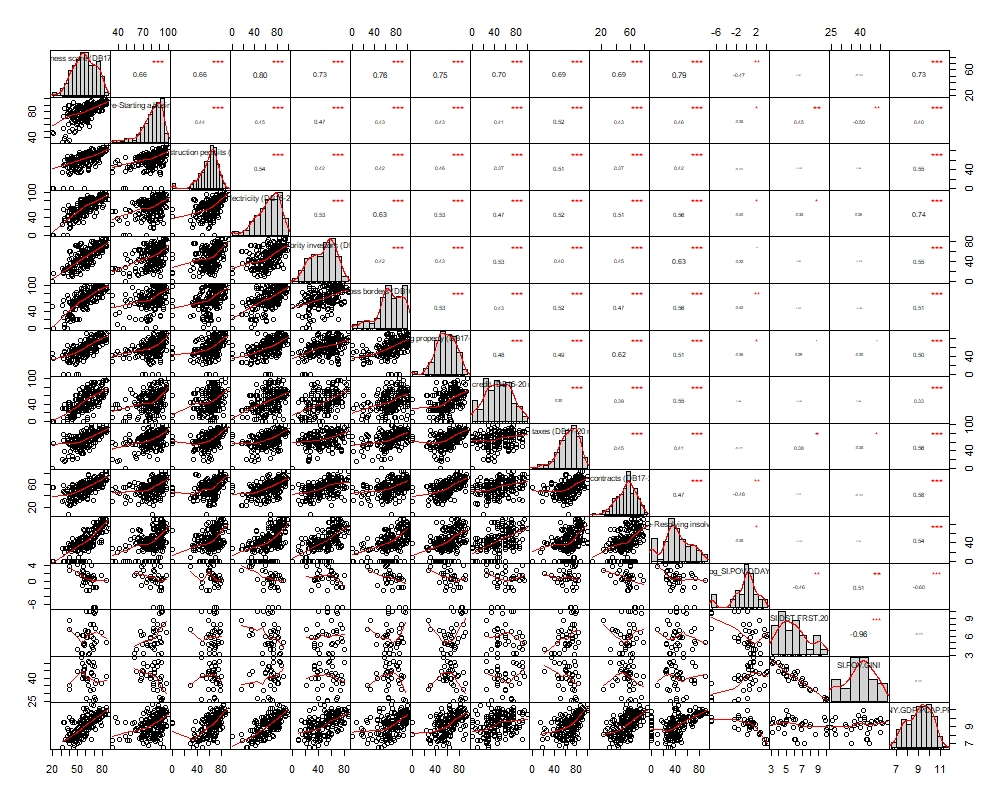
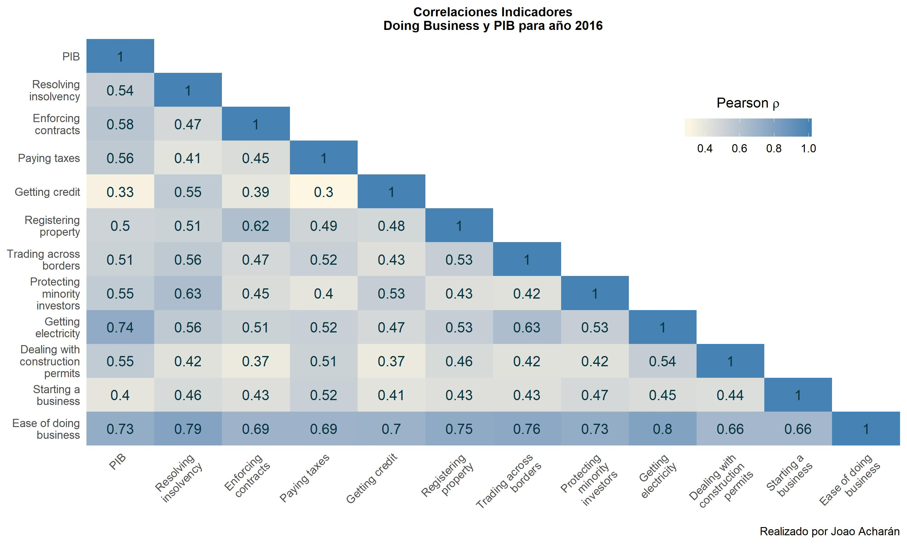
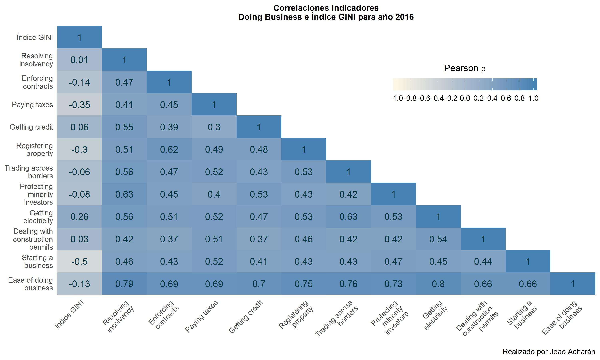
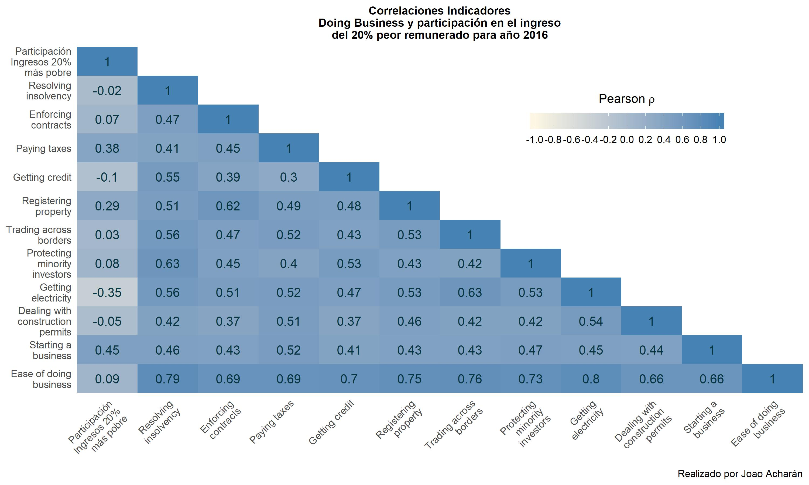
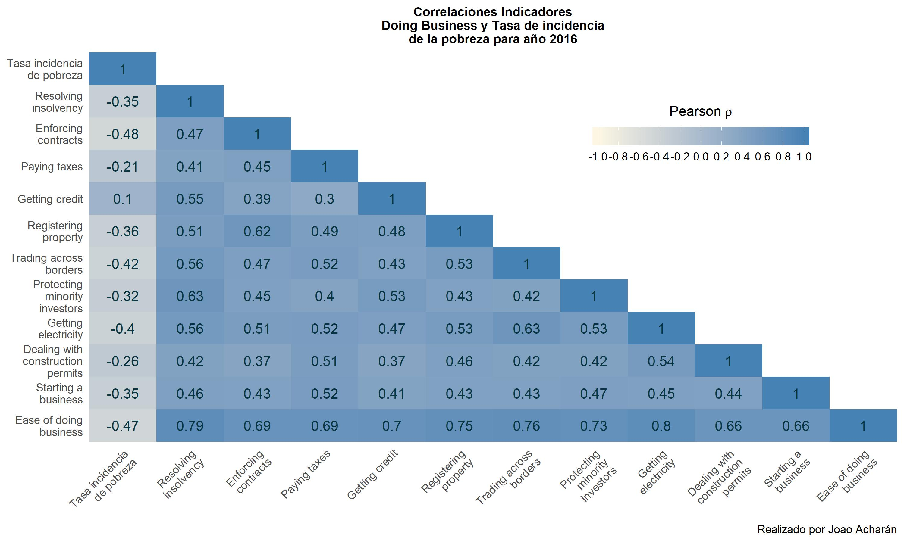

# doing-business
<b>Descripción de los datos</b>

En primer lugar, se descargó una base de datos de diferentes indicadores de desarrollo para todos los países con datos disponibles (generada en https://databank.bancomundial.org/), entre el periodo de 1990 y 2020. En dicha Base de datos, se cuenta con registros para 217 economías, todas ellas identificadas por el nombre del país o región y un código identificador. 

Por otra parte, se utilizó la base de datos completa de Doing Business, para todos los temas desde el año 2004 hacia adelante, pero donde para gran parte de los indicadores solo considera registros a contar desde el año 2016 (generada en https://espanol.doingbusiness.org/). Esta base de datos contiene información para 213 economías, identificadas por nombre de país o región y código identificador. 

Ambas bases de datos presentan diferencias en la redacción del nombre del país o región, pero en ambas bases de datos se utiliza el mismo código identificador para cada país. De esta manera, utilizando dicha variable, se procedió a unificar ambas bases de datos en una sola base, filtrando exclusivamente las observaciones para los años entre 2016-2020.

<b>Descripción de variables consideradas</b>

Indicador Doing Business: Corresponde a variable cuantitativa, numérica y continua, que varía entre 0 y 100, siendo 0 el desempeño o rendimiento más bajo en términos de facilidad para hacer negocio, y 100 el mejor desempeño o rendimiento (https://espanol.doingbusiness.org/es/data/doing-business-score). Los indicadores considerados son:

•	Indicador de facilidad para hacer negocios

•	Indicador de facilidad para iniciar un negocio

•	Indicador de manejo de permisos de construcción

•	Indicador de obtención de electricidad

•	Indicador de protección de inversionistas minoritarios

•	Indicador de comercio transfronterizo

•	Indicador de registro de propiedad

•	Indicador de obtención de créditos

•	Indicador de pago de impuestos

•	Indicador de cumplimiento de contratos

•	Indicador de resolución de insolvencia

PIB per cápita con paridad de poder de compra (a precios internacionales constantes de 2011): Corresponde a variable cuantitativa, numérica y continua. 

índice de Gini: Corresponde a variable cuantitativa, numérica y continua. Se trata de índice que oscila entre 0 y 1, en donde 0 se corresponde con la perfecta igualdad y donde el valor 1 se corresponde con la perfecta desigualdad.

Participación en el ingreso del 20% peor remunerado de una economía: Corresponde a variable cuantitativa, numérica y continua.

Region: Corresponde a variable cualitativa, categórica, nominal. Categorías son Europe & Central Asia, Latin America & Caribe, Midle East & North Africa, South Asia, Sub-Saharan Africa, East Asia & Pacific, North America.

Income group: Corresponde a variable cualitativa, categórica, ordinal. Categorías son Low income, Lower middle income, Upper middle income, High income

<b>Alcances metodológicos</b> 

Todos los indicadores Doing Business presentan una correlación positiva entre ellos, la que resulta media-alta y significativa. Si bien es esperable que la performance de un país difiera entre un indicador y otro, pudiéndose observar buenos rendimientos en algunos ámbitos y no tan buenos rendimientos en otros, esto sugiere que de todas formas los países que lo están haciendo bien en alguna dimensión evaluada, también lo hacen bien en las demás.

A continuación, se observan las correlaciones para el año 2016.

Debido a que el indicador de facilidades para hacer negocios presenta alta correlación con todos los indicadores de Doing Business, se decidió estimar dos modelos para cada indicador macro-económico, para evitar <b> problemas de multicolinealidad</b>  entre las variables independientes. De esta manera, para cada indicador macroeconómico se especificó un modelo considerando el indicador de facilidad para hacer negocios y otro modelo con los indicadores Doing Business específicos con los que presentaron correlaciones significativas para los años 2016 y 2017.

En cada uno de los modelos, se introdujo además como variables de control el grupo de ingresos al que pertenece cada país según el Banco Mundial y el año de cada registro, de manera de controlar los efectos fijos por año (2016 a 2020). Para evitar el <b> problema de colinealidad perfecta</b>  (la trampa de variables dummy), en la especificación del modelo se excluyó la variable año 2016 y la variable de grupo de ingresos económicos altos (High income), los que operan como grupo de referencia para la interpretación de los resultados. 

Solo para el caso de los modelos construidos para el PIB per cápita con paridad de poder de compra, se consideró además como variable de control la región en la que se encuentra el país, debido a que la incorporación de dicha variable en los demás modelos genera un <b> problema de inflación de la varianza</b>  que supera con creces los límites recomendados. En concreto, en presencia de la variable región, el factor de inflación de la varianza de la variable del grupo de ingresos aumentaba (duplicándose o triplicándose), dando cuenta de colinealidad entre dicha variable y región.

Para corregir los problemas de <b> heterocedasticidad</b>  (evaluado con test de Breush-Pagan) y <b> autocorrelación serial</b>  (evaluado con estimador Durbin-Watson) que presentaban los modelos OLS especificados, se estimó cada modelo de regresión con <b> mínimos cuadrados generalizados</b>  (generalized least squares), a través del <b> método de Cochrane-Orcutt</b> . Cabe destacar que previó a la estimación de los modelos con mínimos cuadrados generalizados, se revisó la correcta especificación de cada modelo y la forma funcional de las variables consideradas mediante la <b> prueba del error de especificación RESET de Ramsey</b> , lo que implicó en algunos casos cambiar la variable dependiente a escala logarítmica (PIB y la tasa de incidencia de la pobreza). Solo cuando la prueba RESET de Ramsey ya no evidenció problemas en la especificación de los modelos, pero continuaban presentes problemas de heterocedasticidad y autocorrelación, se estimó cada modelo con mínimos cuadrados generalizados. 

<b>Resultados</b>

<b>PIB per cápita con paridad de poder de compra</b>

Para el año 2016, el PIB per cápita con paridad de poder de compra (a precios internacionales constantes de 2011), en base logarítmica, presenta una correlación positiva (mediana y alta) y significativa, con todos los indicadores desarrollados por Doing Business, dando cuenta de la relevancia del ambiente de negocios para el crecimiento económico de un país. Los indicadores que presentan la correlación más alta con el PIB per cápita son el puntaje global de facilidad para hacer negocios (0,73) y el indicador de obtención de electricidad (0,74).

Para observar si esta tendencia se repite en el tiempo, se observa que controlando por año, región y grupo de ingreso de cada país, el indicador de facilidad para hacer negocios tiene un impacto positivo y significativo (inferior a un nivel de significancia de 0), con el PIB, evidenciando que el aumento de un punto en el indicador de facilidad para hacer negocios reporta un crecimiento en el PIB per cápita de un país.

Por otro lado, controlando solo por año y grupo de ingreso, constatamos que todos los indicadores incorporados al modelo resultan significativos para explicar varianza en el PIB, aunque a diferentes niveles de significancia, con la sola excepción del indicador de facilidades para el pago de impuestos. Resulta llamativo, eso sí, que para los indicadores de facilidades para la apertura de un negocio, facilidades para la obtención del crédito, y el indicador de comercio transfronterizo presentan estimadores con signo negativo, lo que implica que, manteniendo todos los demás factores constantes, el aumento en un punto en la puntuación en dichos indicadores tiene un efecto negativo sobre el PIB per cápita. Este resultado resulta contraintuitivo, e incluso difiere de la correlación positiva y significativa, antes observada al observar la relación bivariada entre dichas variables y el PIB para el año 2016. 

<b>Índice de Gini</b>

En cuanto a la relación entre los indicadores Doing Business y el índice de Gini, se observan resultados disimiles. Por una parte, destaca que solo dos indicadores presentan una correlación significativa (a diferentes niveles de significancia) con el índice de Gini. Lo que permite inferir que gran parte de las dimensiones que caracterizan un ambiente de negocios tienen un impacto neutro sobre la desigualdad económica. Por otro lado, se observa que el indicador de Apertura de negocios presenta una correlación significativa y negativa con el índice de Gini, lo que da cuenta de que países con más facilidades para el desarrollo de nuevos negocios y empresas tienden a tener un menor nivel de desigualdad que aquellos que tienen una peor performance en ese indicador. Asimismo, si bien con una correlación más débil, se observa una relación de iguales características entre la desigualdad económica y el indicador de facilidad para el pago de impuestos.

Controlando por año y grupo de ingreso, el indicador de facilidad para hacer negocios resulta significativo y con un efecto negativo sobre el índice de gini, tal como se esperaba. De esta manera, el aumento en una unidad de la puntuación en el indicador de facilidad para hacer negocios contribuye en una disminución de la desigualdad de ingresos.

Asimismo, los indicadores de facilidades para la apertura de negocios y para el pago de impuestos también resultan significativos controlando por año y grupo de ingreso, teniendo el efecto esperado sobre el índice de gini: el aumento de un punto en la puntuación de dichos indicadores tiene un impacto en la disminución de la desigualdad de ingresos. 

<b>Participación en el ingreso del 20% peor remunerado</b>

Al observar la relación entre los indicadores Doing Business y la participación en el ingreso del 20% peor remunerado de una economía, se reafirman los hallazgos preliminares observados en el punto anterior. En este caso, nuevamente destacan los indicadores de facilidades de apertura de negocios y pago de impuestos como aquellos que tienen una correlación significativa y positiva con la participación en el ingreso del 20% peor remunerado. Esto implica que aquellos países que presentan mejor rendimiento en ambos indicadores presentan también una participación más alta del 20% peor remunerado en los ingresos del país.

Controlando por año y grupo de ingreso, el efecto del indicador de facilidad para hacer negocios sobre la participación en el ingreso del 20% peor remunerado de la economía de un país, resulta significativo. El efecto, además, es positivo, esto es, que el aumento en un punto de la puntuación obtenida en dicho indicador provoca un aumento en la participación del 20% peor remunerado en los ingresos del país, en línea con la disminución de la desigualdad de ingresos antes indicada. 

Al observar los efectos los indicadores puntuales de facilidades para la apertura de negocios y de pago de impuestos, se observa que solo el primero tiene un efecto significativo, al momento de controlar por año y grupo de ingreso del país. En esa línea, el aumento de un punto en la puntuación en el indicador de apertura de negocios mejora la participación del 20% peor remunerado en el ingreso del país.

<b>Tasa de incidencia de la pobreza sobre la base de US$1,90 por día (2011 PPA)</b>

Finalmente, la Tasa de incidencia de la pobreza (% de la población), comprendida sobre la base de US$1,90 por día (2011 PPA), evidencia correlaciones negativas que resultan significativas con alguno de los indicadores Doing Business, dando cuenta de que los países con buenos rendimientos en esas dimensiones presentan una menor proporción de su población viviendo con menos de US$1,90 por día. Estos corresponden al indicador global de facilidad para hacer negocios, el indicador de comercio transfronterizo, y las facilidades en cuanto a la obtención de electricidad y el manejo de permisos de construcción.

Controlando por año y grupo de ingreso, se observa que el indicador de facilidad para hacer negocios tiene un efecto significativo y negativo, dando cuenta que el aumento de un punto en el indicador impacta disminuyendo la tasa de pobreza.
Asimismo, en el segundo modelo, solo el indicador de apertura de negocios tiene un efecto significativo a un nivel de significancia inferior al 0.05, en la misma dirección que el indicador global de facilidad para hacer negocios: manteniendo los demás factores constantes, una mejor performance en materia de facilidades para la apertura de negocios genera una reducción de la tasa de pobreza en una economía.
